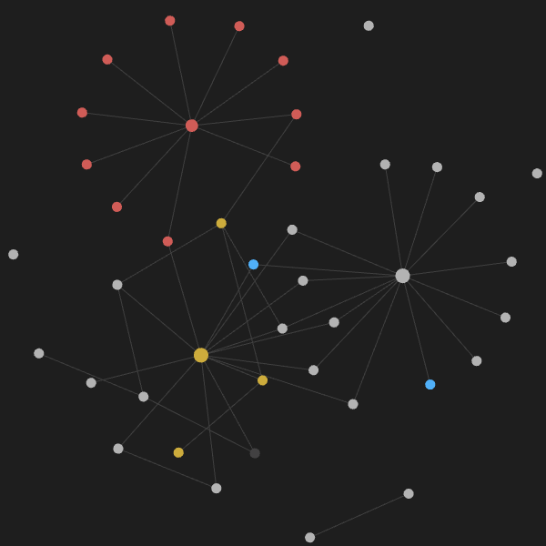
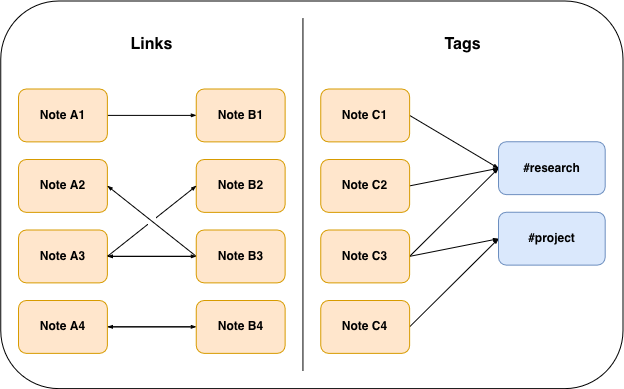
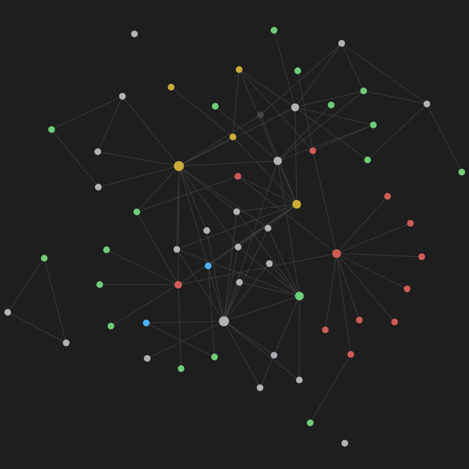

## 1. Introduction

Once you start using Obsidian to write notes, you will come across the concept of linking and tagging notes. And you will soon see yourself doing it because, unless you are not like me, you will become addicted to slowly building a pretty network of your notes that you can see in Graph View. But how are linking and tagging different? Because they both represent connections between notes, it can get a bit confusing. So, in this article, I will briefly go over exactly what links and tags are in Obsidian, how they are different, and how to use them.

<center>
<figure>
    
    <figcaption>A small graph of my notes</figcaption>
</figure>
</center>

## 2. Tags

This is a tag `#icecream`. Tags group your notes together to specific ideas. You can add them anywhere in your note. You can also associate a note with tags by creating a YAML front matter (a block of metadata at the top of the Markdown file enclosed by three dashes `---`) .
```yaml
---
tags:
- keyword-1
- keyword-2
- keyword-3
  ---
```

A python-like list also works in the front matter. Note that this method is not in the official Obisidan [docs](https://help.obsidian.md/tags) and the docs specifically stresses that the tags should be formatted as a Markdown list. Regardless, it works.
```yaml
---
tags: [keyword-1, keyword-2, keyword-3]
---
```

Just remember two things:

1. Tags can't have spaces (so use underscores or hyphens instead if you want to separate out words (or use camelCase or PascalCase))
2. Tags can't be just numbers. So `#2025` will be no good.

If you want to be fancy, you can also use `nested tags` to create tag hierarchies. This can be done by using forward slash (`/`) in a tag. For example, `#snacks/icecream` and `#snacks/candies` are hierarchical tags with `#snack` as the parent and `#icecream` and `#candies` as children. Unless you have a very specific need, I wouldn't personally recommend nested tags too much; they over-complicate things. A simple, not-nested tags are more than good enough for most, if not all, occasions.

## 3. Links

More precisely called [internal links](https://help.obsidian.md/links), links are a way to refer to other files in the Obsidian vault. While tags can only be part of  many-to-one uni-directional connections (notes being the many and a tag being the one that can only receive connections), links are naturally one-to-one bi-directional connections (between two notes).

<center>
<figure>
    
    <figcaption>A diagram comparing links and tags. Links create bi-directional connections between notes. Tags create uni-directional connections from a note to a tag. </figcaption>
</figure>
</center>

Creating a link is easy. you can simply press `[` twice to automatically get `[[]]` and start typing the name of the file you want to link.
```
[[linked-page]]
```

You can also use the Markdown link format to create a link using square and round brackets. 
```
[linked-page](linked-page.md)
```

A nice feature with links is that they can have aliases that are displayed instead of the file name. This is especially useful if the file name is long or uninformative. Just add a `|` after the file name and type your preferred text.
```
[[a-very-long-file-name-that-is-uninformative|A short alias]]
```

## 4. How are links and tags different?

Although they serve the same purpose of linking ideas and notes. There are some differences in how they operate inside Obsidian.

### 4.1. Click behaviors are different

If you click a tag, Obsidian opens a search for that tag on the left sidebar that shows all the notes containing the same tag.

If you click a link, Obsidian will open that linked note.

### 4.2. Links automatically updates, tags do not (out of the box)

A big difference that might push one to use links is that Obsidian (by default) automatically updates links when you rename a file. This is especially useful if you have a note that has many backlinks (files that has a link to the note). You don't have to painstakingly edit each note that has links to the renamed link.

Tags, on the other hand, cannot be altered retroactively (at least in standalone Obsidian). If you tag a note, it will always have that tag unless you manually change it. So, for example, if you find a typo in your tag `#equiptment` after using that tag for 100 notes, you have to find the tag in each note and edit the tag. However, this is a non-problem if you install community plugins like [Tag Wrangler](https://github.com/pjeby/tag-wrangler) which let you bulk rename tags.


###  4.3. Links and tags are displayed separately in Graph View

In Obsidian's Graph View, notes are nodes and links are lines (or vertices and edges, respectively, if you are using graph theory terminology). By default, tags are not displayed in Graph View; you have to enable them in the filters. Tags appear as nodes, and lines connect notes containing the tags to the tag node.

One small problem with using both tags and links is that you can get duplicate connections. I have a MOC (map of content) note where I have linked all my separate research notes. I also use the tag `#research` for every note that can be categorized as research. So, now, I have two central nodes, serving nearly the same purpose and connecting the same nodes. For some, this might not even be a problem, but for me, I find things like this sub-par and annoying.

<center>
<figure>
    
    <figcaption>A Graph View with tags enabled. Notice how tags (in green) complicate the graph with repetitive connections. This is especially noticeable on the two central nodes (one gray, the other green) just below the center of the image. </figcaption>
</figure>
</center>

## 5. How to use links and tags

### 5.1. Option 1

One option is to simply don't use tags at all. Instead, use certain notes as tags and link these notes whenever you want to categorize a note. For example, instead of `#coffee`, you can use `[[coffee]]` to signal that the note you are writing is about coffee. This way you won't have two nodes `#coffee` and `[[coffee]]` in your graph.

However, this solution does not work for me because I write my blog articles in Obsidian and I want to use tags (in YAML front matter) as they serve a function on my website. If I didn't have this extra condition, this would have been the best solution.

### 5.2. Option 2

The second option, you guessed it, is to use tags only. But how do you create a link-like tag when tags by definition cannot be a one-to-one connection between two notes? Also, the click behavior of tags is to display a list of the notes with that tag on the sidebar; how would you open a note by clicking a tag?

The solution is somewhat complicated. For each note, we create a tag which is going to be used as an alias for that specific note only. In other words, you have a tag for each note. To apply this solution, you have to first install the community plugin, [Tag Wrangler](https://github.com/pjeby/tag-wrangler). We will be using a feature of the plugin called [Tag Pages](https://github.com/pjeby/tag-wrangler#tag-pages) which converts the click behavior of tags to opening the note (page) that has that tag as an [alias](https://help.obsidian.md/aliases). Thus, we now have tags that function like links. Is this all confusing? It should be, because it is. It's a fair bit janky as well, so I don't recommend it.

The first question I had after applying this method was what would happen if, by accident, there are two or more Tag Pages with the same alias. I tested this out by creating two pages with the same alias.
```yaml
---
Alias: #some-tag"
---
```

And I created a new note and typed `#some-tag`. When I clicked this tag multiple times, it always directed me to the first page I created with the alias - the second page is unreachable.

This is not the only problem. With this setup, we now have two types of tags:

1. Tags that are actual tags,
2. Tags that act like link to pages.

And you wouldn't know which of the two a tag is just by looking at it. This is far from ideal.

### 5.3. Option 3

The best option, personally, is to simply use both. Though they overlap in functionality, the overlap is not complete. So, if you choose to use only one, you will be missing out on some features that are only available on the other. For example, if you choose only to use links, you will be missing out on features like `search by tags`, available in the left sidebar, and `tag view`, available in the right sidebar that keeps a tally on the number of pages with each tag.

## 6. Summary

There is no wrong way to use tags and link; after a while, you will find a system that best suits your needs. It is important, at least for myself, to remember that in the end, Obsidian is just a tool. I shouldn't spend too much time struggling to find the perfect setup but do what Obsidian is meant to do.

Keep on writing and enjoy the process of creating your personal digital library of knowledge.

## External resources

These are some articles I checked out while I was figuring out my own system of using links and tags.
- https://forum.obsidian.md/t/a-guide-on-links-vs-tags-in-obsidian/28231
- https://forum.obsidian.md/t/folders-vs-linking-vs-tags-the-definitive-guide-extremely-short-read-this/78468