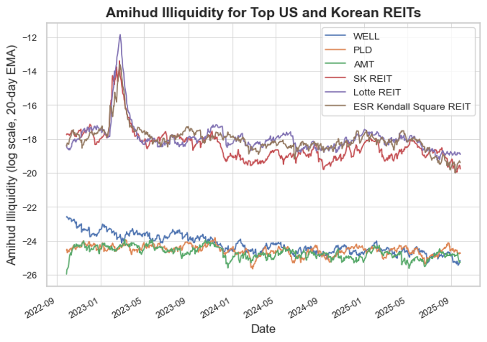

## 1. Introduction

The Amihud illiquidity measure (Amihud, [2002](https://www.sciencedirect.com/science/article/pii/S1386418101000246)) is the average ratio of daily absolute stock return to its dollar trading volume. Mathematically, the Amihud illiquidity of a stock for a given period is defined as:
$$
{ILLIQ}=\frac{1}{N}\sum_{t=1}^{N}{\frac{|{R_t}|}{VOLD_t}}, \tag{1}
$$
where $R_t$ is the daily return at time $t$, $VOLD_t$ is the trading volume in USD at time $t$ and $N$ is the number of days in the given period. Note that it is a measure of *illiquidity* and not *liquidity* - a stock with high Amihud illiquidity has low liquidity. If you want to measure the daily Amihud illiquidity instead of the average Amihud illiquidity over a certain period, you can simplify Equation 1 to get the simple ratio:
$$
{ILLIQ_t}=\frac{|{R_t}|}{VOLD_t}. \tag{2}
$$
In essence, the measure considers how much a trade moves the stock’s price, the so called price impact. A few reasons why this measure is useful:
1.  Simplicity: The measure is the average of a simple ratio of absolute daily return to dollar volume, capturing the price impact of trading. Hence, it is straightforward to understand and calculate.
2. Data availability: The measure uses two types of information (daily return and volume) that are readily available.

However, the measure is not without its flaws. If you have a look at Equation 1, the nominator ($|R_t|$) is a small positive number close to 0 while the denominator (${VOLD_t}$) can get arbitrarily large, especially for large cap stocks. Consequently, ${ILLIQ}$ is going to be an extremely small positive number close to 0. Such absolute difference in scale between the two terms suggests that the measure will be largely driven by the denominator, $VOLD_t$. In other words, assuming a stock has an average daily return of $0.05\%$ ($0.0005$), we expect that:
$$
{ILLIQ_t}=\frac{|{R_t}|}{VOLD_t}\approx\frac{0.0005}{VOLD_t}. \tag{3}
$$

## 2. Empirical analysis

### 2.1. Data

As a sanity check that the measure works as intended, we conduct a simple empirical analysis. We use daily data on top 3 US REITs (real estate investment trust) and Korean REITs (K-REITs). The data (price and volume) was collected for a period of 2 years and the stock prices of K-REITs were converted to USD using daily KRW/USD exchange rate.

Table 1. Top 3 US REITs and K-REITs and their market capitalizations.

|Rank|US REITs|Market Cap|K-REITs|Market Cap|
| --- | --- | --- | --- | --- | 
|1|Welltower Inc.     |$113 billion|SK REIT|$962 million|
|2|Prologis Inc.     |$107 billion|Lotte REIT     |$783 million|
|3|American Tower Corp.     |$87 billion|ESR Kendall Square REIT      |$767 million|

Considering the much larger market capitalization of US REITs compared to K-REITs, we expect US REITs to be more liquid (and hence have lower Amihud illiquidity).

### 2.2. Methodology

We calculate the daily $ILLIQ$ using Equation 2 for the entire data period of 2 years. We post-process the result by taking the logarithm and applying [exponential smoothing](https://en.wikipedia.org/wiki/Exponential_smoothing) so that we can better visualize the results. Rounding up, for each daily stock data:
1. We multiply the the daily volume to the stock price to get the daily dollar volume, $VOLD_t$,
2. We convert the stock price, $P_t$, into daily return, $R_t=P_t/P_{t-1}-1$,
3. We calculate the daily log Amihud Illiquidity, $\ln{ILLIQ_t}=\ln{\frac{|{R_t}|}{VOLD_t}}$.

## 3. Results

In Figure 1, we can see the large illiquidity gap between US and Korean REITs; all three K-REITs have much higher illiquidity. It is also interesting to see an illiquidity spike in 2023 for K-REITs. The spike matches the time of major domestic credit crunch, triggered in late 2022 by the "[Legoland crisis](https://www.koreaherald.com/article/2982572)" where the developer for Legoland Korea theme park defaulted on 205 billion KRW (approx. $150 million) of commercial paper.

Figure 1. Amihud Illiqudity of TOP US and Korean REITs.

## 4. Other measures

There are other stock (il)liquidity measures and indicators. Provided below is a table of the major ones.

|Metric|What it is|How it indicates liquidity|
|---|---|---|
|Trading Volume|The total number of shares of a stock traded over a specific period.|High volume means many buyers and sellers are active, making it easy to buy or sell shares quickly without significantly impacting the price.|
|Bid-Ask Spread|The difference between the highest price a buyer is willing to pay (bid) and the lowest price a seller is willing to accept (ask).|A narrow spread indicates high liquidity because there is a consensus on the stock's price, while a wide spread suggests less liquidity.|
|Turnover Ratio|The number of shares traded over a period divided by the average number of shares outstanding.|A high turnover ratio signifies that a stock is being traded frequently, which points to higher liquidity.|
|Market Depth|The volume of buy and sell orders at different price levels.|A stock with high market depth has a large number of orders at various prices, indicating it can absorb large trades without major price swings.|
|Price Impact|Measures how much a trade moves the stock's price.|A lower price impact means large trades have less effect on the price, which is a sign of higher liquidity.|

## References

- Yakov Amihud. Illiquidity and stock returns: Cross-section and time-series effects. Journal of Financial Markets, 5:31–56, 2002.

