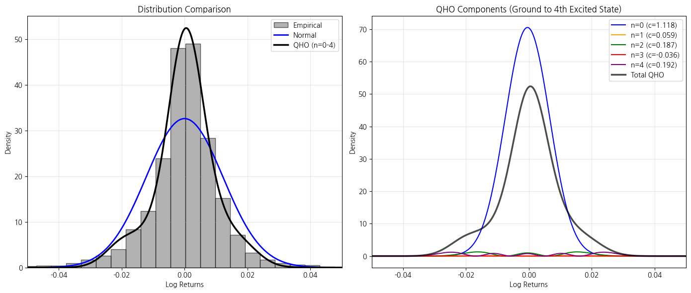

## What is a quantum harmonic oscillator?

Before we talk quantum, we start with the simpler, classical variant. A *classical* harmonic oscillator is any system that experiences a restoring force proportional to displacement. The simplest example is a ball on a spring. When the ball is displaced from its equilibrium position, the spring pulls it back, and it oscillates. The force is given by Hooke's Law:

$$
F=-kx,
$$

where $F$ is the restoring force, $k$ is the sprint constant, and $x$ is the displacement from equilibrium. This equation leads to the difference equation:

$$
m\ddot{x}+k\dot{x}=0,
$$

whose solution is deterministic and periodic:
$$
x(t)=Acos(\omega t + \phi),
$$
where $A$ and $\phi$ are determined by initial conditions.

The quantum harmonic oscillator (QHO) is the quantum-mechanical version of the classical harmonic oscillator. Among other things, it is a good approximation for small vibrations of atoms and molecules. It is also notable that QHO is one of the few systems in quantum mechanics with an exact, closed-form solution.

<figure>

<figcaption>Figure 1. Trajectories of harmonic oscillator according to classical mechanics (A and B) and quantum mechanics (C to H). Image is sourced from Wikipedia.
</figure>

## How are the two oscillators different?

Table 1 shows the main differences between the quantum and classical harmonic oscillators. The most noticeable difference is that we do not have continuous energy in quantum mechanics. Instead, we have discrete quantum states (state 0, 1, 2,... and so on). We call the 0th state, the ground state, and the states after are called the 1st excited state, 2nd excited state, and so on. Also, unlike the ball on a spring which can have zero energy (at rest/equilibrium), a QHO has a non-zero energy at the lowest, ground state.

Table 1. A comparison between QHO and classical harmonic oscillator

|Feature|Classical Harmonic Oscillator|Quantum Harmonic Oscillator|
|---|---|---|
|**Energy**|Continuous (any value possible)|Discrete (quantized energy levels: $( E_n = (n + \tfrac{1}{2})\hbar\omega ))$|
|**Ground State Energy**|Zero (can be at rest)|Non-zero: ($\tfrac{1}{2}\hbar\omega )$ — **zero-point energy**|
|**Position and Momentum**|Can be known exactly at any moment|Governed by the **Heisenberg Uncertainty Principle** — can’t know both exactly|
|**Motion**|Oscillates smoothly and deterministically|Described by a **probability wave** (wavefunction) — doesn't have a definite position|
|**Allowed States**|Infinite, smooth transitions|Only certain **quantum states** ( $n = 0, 1, 2, \dots )$, each with a distinct wavefunction|

## Why do we need the QHO in finance?

Because it works!

We use it because, with the right assumptions, we can apply the QHO model to estimate the distribution of the stock returns much better than traditional methods like the Black-Scholes model which assumes that financial returns are normally distributed. However, real-world returns are far form normal and exhibit skewness and fat tails (excess kurtosis). This means that with the Black-Scholes model, among many things,  will under-evaluate risks.

On the other hand, the QHO model is able to incorporates these real-world characteristics of financial returns.

## Why not the classical harmonic oscillator?

The classical harmonic oscillator does not work mainly because its solution is deterministic which is very far from the probabilistic nature of financial markets.

## A simple example of the QHO model in finance

We estimate the QHO model and the random walk model (RWM; normal distribution) using the daily log-returns of the S&P500 over the last 25 years.

<figure>

<figcaption>Figure 2. A comparison between the QHO and RWM models (left) and the proportion of QHO components (right).
</figure>

In the left sub-plot of Figure 2, it is easy to see how far off the normal distribution, in blue, is from the actual data (histogram). On the other hand, the QHO model precisely estimate the empirical distribution of the log-returns.

## Other things

Later I will provide you with the derivation of the QHO model.